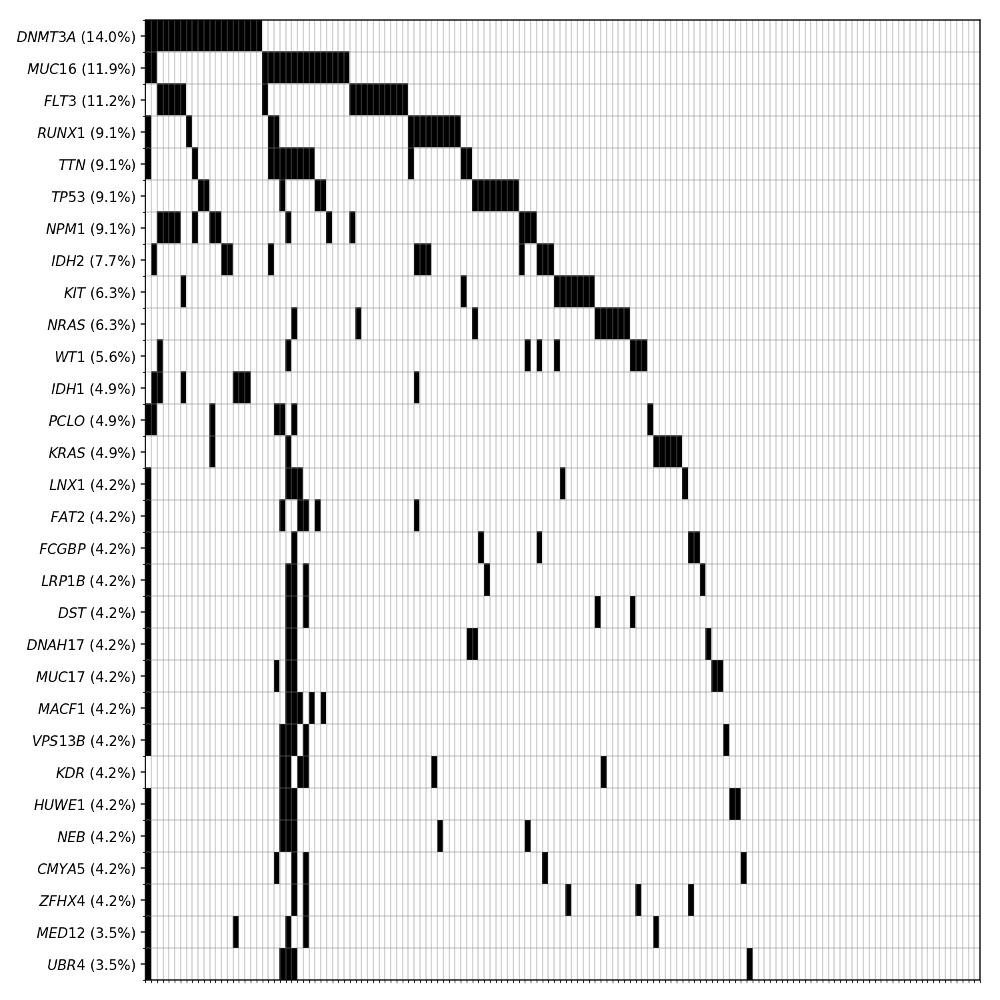
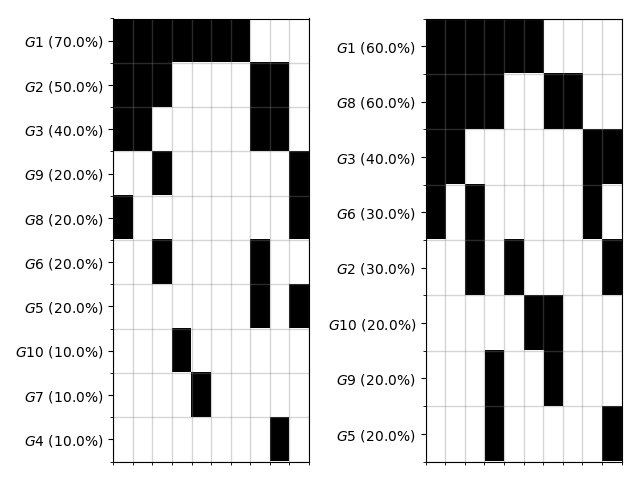

# mutation-waterfall

 

Python library for visualizing mutation landscape as waterfall diagram.

## Gallery

**Mutational landscape of TCGA-LAML cohorts.**



## Usage

### Input format

Input file should be formatted as below (tab-delimited):

```shell
Sample	Mutation
S1	Gene1
S1	Gene2
S1	Gene3
S2	Gene2
S2	Gene4
...
S100	Gene130
S100	Gene142
```

### Plotting

Plotting mutation waterfall plot can be done with `mutation_waterfall.plot.plot` function. Specify the path to your input file as an `mutation_list_file` positional argument.

```python
import mutation_waterfall.plot as mwp
mwp.plot(mutation_list_file='input.txt')
```

Executing command above results in a beautiful waterfall plot.


### Tweaking parameters

You can specify the number of genes to be shown with `n_genes` parameter (default: 30).

```python
mwp.plot('input_txt', n_genes=5)
```


You can specify the matplotlib axis of the waterfall plot with `ax` parameter.

```python
import matplotlib.pyplot as plt
fig = plt.figure()
# Draw first waterfall in the left side.
ax = fig.add_subplot(121)
mwp.plot('input.txt', ax=ax)
# Draw second waterfall in the right side.
ax = fig.add_subplot(122)
mwp.plot('input2.txt', ax=ax)

plt.tight_layout()
plt.savefig('waterfall.png')
```



You can save waterfall plot to an image file by specifying `file` parameter.

```python
mwp.plot('input_txt', file='waterfall.png')
```

